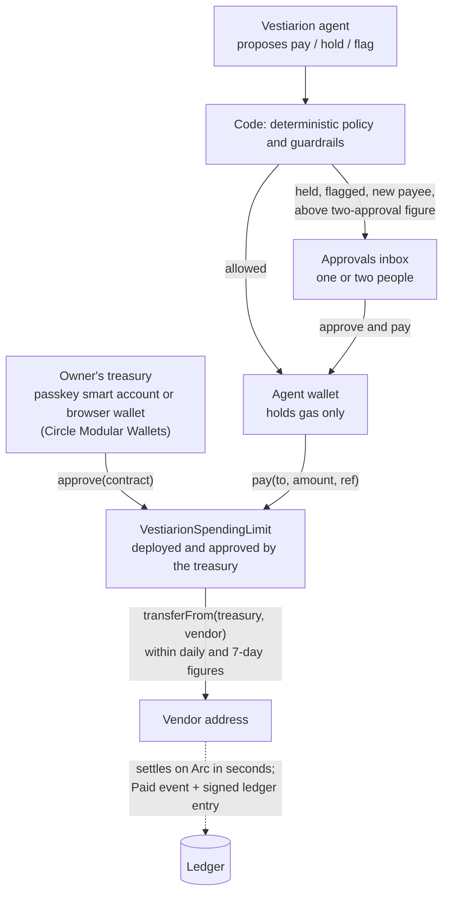
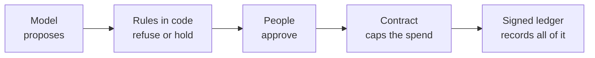

<div align="center">


# Vestiarion

**An AI treasury agent that pays a business's bills in USDC on Arc, inside limits a contract enforces and a signed ledger proves.**

[](https://www.vestiarion.xyz)
[](https://www.vestiarion.xyz/open)
[](https://www.vestiarion.xyz/docs)
[](https://www.npmjs.com/package/@vestiarion/sdk)
[](https://github.com/duongnq2798/vestiarion/actions/workflows/ci.yml)
[](LICENSE)
[](https://www.youtube.com/watch?v=hIS3THDLtVQ)

[](https://explorer.arc.io/tx/0xcecef38e3f751bc118f8f00cee5bb5344679e84f89123d679b986b47d7f1dee6)
[](https://www.vestiarion.xyz/docs/guides/try-it)
[](#circle-integrations)
[](https://www.vestiarion.xyz/docs/api)
[](https://www.vestiarion.xyz/docs/guides/slack)
[](https://www.vestiarion.xyz/docs/guides/telegram)

**[Open the app](https://www.vestiarion.xyz)** · **[Watch the demo](https://www.youtube.com/watch?v=hIS3THDLtVQ)** · **[Try it in 5 minutes](https://www.vestiarion.xyz/docs/guides/try-it)** · **[Open numbers](https://www.vestiarion.xyz/open)** · **[Docs](https://www.vestiarion.xyz/docs)** · **[@vestiarionhq](https://x.com/vestiarionhq)**

</div>

Vestiarion runs a small business's money cycle with one agent: it screens counterparties, pays vendors, releases
contractor pay, collects receivables and keeps idle cash working. A model proposes each action; ordinary code decides
whether it may happen; a person decides what code sends to them; and on Arc mainnet the money itself can only leave
through a spending-limit contract the owner's own wallet deployed. Every outcome, refusals included, is signed into a
hash-chained ledger anyone in the workspace can verify.

**Watch it work:** [the full demo](https://www.youtube.com/watch?v=hIS3THDLtVQ) (4:48, recorded from the live app: decisions, shadow
mode, customers and Arc mainnet in the first 2:20, then email intake, cross-chain payouts, EURC, x402, escrow, GitHub
bounties and collections) or [a 2:50 cut](https://youtu.be/3I-HfGHHbWs).

> *Tameion* is ancient Greek for a treasury, the room the money was kept in. In Byzantium that room grew into the
> *vestiarion*, the department that minted the coin, held the stores and paid the army.

## Contents

- [What Vestiarion does](#what-vestiarion-does)
- [Why it is different](#why-it-is-different)
- [How payments work](#how-payments-work)
- [Safety architecture](#safety-architecture)
- [Arc mainnet and Arc testnet](#arc-mainnet-and-arc-testnet)
- [Product capabilities](#product-capabilities)
- [Integrations](#integrations)
- [Primitives for Arc builders](#primitives-for-arc-builders)
- [Quick start](#quick-start)
- [Verifiable activity](#verifiable-activity)
- [Documentation](#documentation)
- [Development](#development)
- [License](#license)

## What Vestiarion does

A small business pays vendors, contractors and recurring bills through several tools a person stitches together by
hand, and checks none of it continuously. Vestiarion replaces that with one decision loop, the **agent cycle**, that
reads the whole book each time it runs:

| Area | What the agent does |
| --- | --- |
| **Payables** | Three-way match (purchase order, goods received, invoice), duplicate and risk checks, then **pay**, **schedule**, **hold**, **request info** or **flag as fraud**, with its reasoning attached |
| **Contractors** | Releases a milestone once its evidence is verified, such as a merged GitHub pull request; on Arc testnet the milestone's USDC can sit in an escrow contract until then |
| **Compliance** | Re-screens every counterparty each cycle (OpenSanctions where configured) and tiers its payment limit down on a hit, reversibly |
| **Receivables** | A client pays through a link; the agent matches the transfer to what was owed and, when turned on, sends reminders within bounds code sets |
| **Treasury** | On Arc testnet, sweeps idle cash above a 7-day buffer into Circle's USYC only when the yield beats the round-trip fee, and redeems ahead of what falls due |
| **Audit** | Appends every decision, human action and system event to an Ed25519-signed, hash-chained ledger, exportable and verifiable in one click |

The agent cycle: reconcile -> receipts -> compliance -> follow-up -> recurring -> services -> liquidity -> AP ->
contractors -> treasury -> forecast -> proposals -> collections -> notices -> telegram -> slack, each stage's
outcome appended to the ledger.

## Why it is different

- **The model argues; it cannot pay.** Anthropic, OpenAI or DeepSeek returns a structured
  `{action, reasoning, confidence}`. Code re-checks every hard rule after the model decides and before money moves, and
  with no model key at all a transparent rule-based policy takes the model's place. Every ledger entry records which one
  decided, and the written policy's answer is recorded beside the model's
  ([research: when the model and the policy disagree](https://www.vestiarion.xyz/docs/research/model-vs-policy)).
- **The limit is on the money's path, not only in the code.** On Arc mainnet a workspace can pay from a wallet its
  owner holds. The agent's wallet can only call `pay` on a contract that wallet deployed, which refuses anything past
  the daily or 7-day figure, whatever Vestiarion's code decided.
- **Vestiarion does not hold that treasury's USDC.** On that path the USDC stays in the owner's wallet or passkey
  smart account; Vestiarion holds no key to it, and the agent's wallet holds only gas. (Other setups differ; see
  [Custody, by setup](#custody-by-setup).)
- **People decide what matters.** A first payment to a new address, a payment above the two-approval figure, and
  anything the agent held all wait for a person, and some for two.
- **Figures are read, not asserted.** [Open numbers](https://www.vestiarion.xyz/open) is queried from the production
  database on every load, with Arc mainnet and Arc testnet counted apart and our own workspaces counted apart from
  customers'.

## How payments work

On Arc mainnet, a workspace whose treasury is its owner's wallet pays like this:



In words:

1. **The owner's wallet is the treasury.** In **Go live** the owner either connects a browser wallet (MetaMask,
   Rabby…) or creates a passkey wallet: a Circle smart account on Arc mainnet owned by their passkey, with an optional
   recovery address. The owner's wallet deploys the workspace's `VestiarionSpendingLimit`, approves it on USDC and
   sends the agent's wallet its gas; with a passkey that is one confirmation, after the browser checks every call
   against what it built itself.
2. **The agent proposes.** Each cycle the model reads the invoice, the counterparty's screening, the match and the cash
   position, and proposes an action with its reasoning.
3. **Code decides.** Duplicate, risk, payment-limit, three-way-match, new-payee, spending-limit and liquidity rules run
   as ordinary code. They can overrule the model; nothing the model writes can overrule them.
4. **A person decides what code sends them,** in the approvals inbox (or from Slack on Arc testnet). A person's
   approval goes through the same payment step the agent uses.
5. **The contract decides last.** The agent's wallet calls `pay(to, amount, ref)`. The contract pulls USDC from the
   treasury to the vendor only within the daily and 7-day figures, and never twice for the same `ref`. Only the owner's
   wallet can change the figures (`setLimits`), or stop the agent by setting its approval to 0.
6. **Arc settles; the ledger records.** Payment status is read back from Circle and the chain, the fee from the
   receipt (Arc's gas token is USDC, so the receipt is the dollar cost), and the outcome is signed into the ledger.

On Arc testnet the same decision path pays from Circle wallets instead, through the same contract once an owner or admin
turns on **Enforce on Arc**.

### Custody, by setup

| Setup | Where the USDC sits | Who can move it |
| --- | --- | --- |
| **Arc mainnet, your own wallet or passkey** | The owner's wallet | The owner; the agent only through the contract, within its figures |
| **Your own Circle account** (testnet or mainnet) | Developer-Controlled Wallets in the customer's Circle account | Vestiarion, with the API key and entity secret the owner pasted, stored encrypted |
| **Hosted testnet wallet** | Wallets in Vestiarion's own Circle testnet account | Vestiarion (Arc testnet only) |

## Safety architecture



| Layer | What it guarantees |
| --- | --- |
| **Guardrails in code** | Never pay a counterparty screened high risk, above its limit, a duplicate of a settled invoice, or with an incomplete match. A refusal records the model's argument and the rule that overruled it |
| **New-payee check** | The first payment to an address needs two people behind it: the agent never makes one that only the person who gave the address stands behind, and that person cannot approve it either |
| **Two approvals** | Above a figure the owner sets, a payment needs two different people. Arc mainnet workspaces start at 100 USDC, and the owner can raise it but not turn it off there |
| **Maker and checker** | Roles are owner, admin, approver and viewer. No one approves an invoice they created; only Compliance clears a high-risk counterparty |
| **Agent spending limit** | A daily and a 7-day figure, checked in code and, where enforced, by the contract. Arc mainnet workspaces start at 50 USDC a day and 150 USDC in 7 days |
| **Exactly once** | A database claim makes one decision exclusive; an idempotency key keyed on the invoice keeps a payment from leaving twice; the contract refuses a repeated `ref` |
| **Stop switches** | Anyone who can approve can pause the agent for the workspace; an owner's wallet can stop the contract; an operator can stop every payment on every deployment within 10 seconds |
| **Audit trail** | Every entry is Ed25519-signed and covers the hash of the one before. The verifier names the first entry that breaks; signed webhooks push each entry as it is written |
| **Shadow mode** | On Arc testnet a business keeps paying its bills itself, a person agrees or disagrees with each agent decision, and only agreed payments are made |

The contract source is in [`contracts/`](contracts). It was written for Vestiarion and has not been audited.

## Arc mainnet and Arc testnet

Each workspace lives on one network, chosen when it is created, and never moves.

| | Arc testnet | Arc mainnet |
| --- | --- | --- |
| **Who can use it** | Anyone who signs in | Only people the deployment opens it to (`MAINNET_ALLOWLIST`) |
| **Money** | Testnet USDC and EURC from Circle's faucet | Real USDC, sent on Arc or brought from another chain through CCTP |
| **Treasury** | Hosted wallet, or your own Circle account | Your own wallet or passkey wallet, or your own Circle account |
| **Spending-limit contract** | Opt-in, deployed through Circle's Smart Contract Platform | Deployed by the owner's wallet on the own-wallet path |
| **Also available** | USYC reserve, milestone escrow, EURC swaps, CCTP and Gateway payouts to other chains, x402, shadow mode | USDC on Arc only; features Arc mainnet lacks are not shown |

### Mainnet proof

On **Oct 7, 2026** a workspace we run made its first payment on Arc mainnet, from a passkey wallet, through its
spending-limit contract:

1. The owner's passkey wallet deployed and approved its contract in one transaction, with figures of 50 USDC a day and
   150 USDC in 7 days: [`0xe6261540…a9bb`](https://explorer.arc.io/tx/0xe62615407f44383d52a470574a877069e7e0114c2a074cc112149b3ab3efa9bb).
2. The agent decided to pay a 0.10 USDC invoice. Code held it: a first payment to a new address
   (`counterparty.new_payee`).
3. A second member, an admin, approved and paid it. The agent's wallet called the contract, which moved 0.10 USDC
   from the passkey treasury to the vendor and emitted `Paid`; fee 0.0035 USDC, settled in 3 s:
   [`0xcecef38e…dee6`](https://explorer.arc.io/tx/0xcecef38e3f751bc118f8f00cee5bb5344679e84f89123d679b986b47d7f1dee6).

Contract: [`0xd90cA89Fc318d0330Bb14eaeF78B72C3CA7E7fB6`](https://explorer.arc.io/address/0xd90cA89Fc318d0330Bb14eaeF78B72C3CA7E7fB6).
Arc mainnet has no customer workspace yet; [Open numbers](https://www.vestiarion.xyz/open) shows the current count.

### Proof on Arc testnet

Made by the agent in production:

- a USDC payable paid 53 seconds after it was added, with no one pressing Run:
  [`0x81381c50…4e68`](https://explorer.testnet.arc.io/tx/0x81381c50f5d0cadb49d1af77f1abb06c1727c8377aa88cbe1cfbf327f09c4e68);
- a payment through the spending-limit contract, within its daily figure:
  [`0xa79cb982…e71e`](https://explorer.testnet.arc.io/tx/0xa79cb982c488d5c8d40cfc6b6141bf30d95f5615e580d3c3d6b55b779fe6e71e);
- a EURC invoice, weighed against a USDC limit at a rate quoted by Circle's Stablecoin Service:
  [`0x2e66257f…8f58`](https://explorer.testnet.arc.io/tx/0x2e66257f2cf478ecd2d0f7e263e1ad78bf9877b0afb93f3679c0601ef7328f58);
- a payout to Base Sepolia through CCTP: the burn on Arc,
  [`0xbc1961bb…d49c`](https://explorer.testnet.arc.io/tx/0xbc1961bbe2896e7e91d452498b595f1a1de8d45f34b7db8b3fd9d873d908d49c),
  and the mint Circle forwarded,
  [`0x6c749323…ef9a`](https://sepolia.basescan.org/tx/0x6c749323f9e36efe21fcd5c33df2e55ba5db82040dbd06ff2a8872045c6fef9a);
- an invoice read from a PDF by the model, checked by a person, and paid 16 seconds after it was added:
  [`0x197e979f…64b3`](https://explorer.testnet.arc.io/tx/0x197e979f3b108d759f5e5e5ee0d7bc67e67acb1c520de1b3c7e969ae689c64b3);
- idle cash into Circle's USYC through its Teller,
  [`0x1cf65900…f42e`](https://explorer.testnet.arc.io/tx/0x1cf659007ce734a73908a705e2537a56065d87fd0f52571d7e67d0654b94f42e),
  then the missing 0.88 USDC redeemed for a bill due today,
  [`0x4b5186db…c7f2`](https://explorer.testnet.arc.io/tx/0x4b5186db4820df87532869e0a9797df5a79a7e9e3a5feb1e3edb09500160c7f2),
  and the bill paid 34 seconds after it was added,
  [`0x365da374…9d8b`](https://explorer.testnet.arc.io/tx/0x365da374f902fcb995643713962554b41e6114b62bb40695874aa519dd829d8b).

Each feature's design under [`docs/superpowers/specs/`](docs/superpowers/specs) ends with its rollout record: what was
run in production, with its ledger entries and transactions.

## Product capabilities

- **AP automation** — invoices typed in, imported from a bill list in its own columns, dates and currency, read from a PDF, forwarded by email, or sent through the
  API; recurring payables; early-payment discounts taken when they pay.
- **Approvals inbox** — approve and pay, reject, or return to the agent; claims keep two people from deciding the
  same row.
- **Contractor milestones** — verified by a merged pull request or a person; GitHub bounties with `/bounty` and
  `/payto`; a pull request comment once paid.
- **Payee links** — a payee enters and confirms their own address, or creates a passkey wallet to be paid in.
- **Receivables** — pay links on Arc, matched receipts, reminders the agent times within bounds.
- **Treasury** — safe-to-spend today, cash outlook, USYC reserve with **Bring cash back** (Arc testnet).
- **Cross-currency and cross-chain** — EURC invoices and swaps, CCTP and Gateway payouts (Arc testnet).
- **Shadow mode** — try the agent on real bills, paid in the business's own way, before it pays anything itself.
- **Report** — what the agent did with a workspace's real bills: payments with their transactions, what it stopped
  and why, how often a person stepped in, discounts measured from the transfers, and what is left before a live slice.
- **Workspaces and members** — per-network workspaces, invitations, four roles, per-member notifications.
- **Audit** — the signed ledger, one-click verification, exports, and signed webhooks.

## Integrations

### Circle integrations

| Circle product | Used for |
| --- | --- |
| **Developer-Controlled Wallets** | Treasury and agent wallets, transfers, balances, confirmation |
| **Modular Wallets** | Passkey smart accounts: the owner's treasury on Arc mainnet, and a payee's wallet |
| **Smart Contract Platform** | Deploying the escrow and spending-limit contracts on Arc testnet |
| **Gas Station** | Paying the agent wallet's gas on Arc testnet |
| **USYC** | The yield-bearing reserve, through its Teller (Arc testnet) |
| **CCTP V2** and **Gateway** | Paying payees on other chains; Gateway also settles x402 purchases (Arc testnet) |
| **CCTP V2 Forwarding Service** | Adding USDC to a workspace's wallet on Arc from Base, Ethereum and other chains, minted by Circle so the wallet needs no gas (both networks) |
| **Stablecoin Service** | EURC quotes and USDC→EURC swaps (Arc testnet) |
| **Notifications** | Settlement and incoming-transfer webhooks, recorded within seconds |

### Team and developer tools

| Surface | What it does |
| --- | --- |
| **[Slack](https://www.vestiarion.xyz/docs/guides/slack)** | Decisions in a channel; `/vestiarion today`, `waiting`, `ledger`; Approve and pay, Reject and Return buttons on Arc testnet within a limit; add an invoice from a message |
| **[Telegram](https://www.vestiarion.xyz/docs/guides/telegram)** | Each member's own chat: decisions with reasons, `/today`, `/waiting`, `/ledger`, invoices read from a PDF. The bot never approves or pays |
| **[REST API](https://www.vestiarion.xyz/docs/api)** | `/api/v1` with per-member keys: read everything, and with write access add counterparties, invoices, milestones and payee links. A key never approves or pays |
| **[TypeScript SDK](https://www.vestiarion.xyz/docs/get-started/sdk)** | [`@vestiarion/sdk`](https://www.npmjs.com/package/@vestiarion/sdk): a typed client for every `/api/v1` operation, plus webhook and ledger verification |
| **[MCP server](https://www.vestiarion.xyz/docs/ai-integration/mcp)** | `/api/mcp`, whose tools are the `/api/v1` operations, for AI agents |
| **[Webhooks](https://www.vestiarion.xyz/docs/webhooks)** | Up to 5 HTTPS endpoints per workspace receive every ledger entry, signed, with retries |
| **[GitHub](https://www.vestiarion.xyz/docs/guides/github)** | Milestone verification from merged pull requests, bounties, and payment comments |
| **[Email](https://www.vestiarion.xyz/docs/guides/email-invoices)** | A workspace address that reads forwarded invoices into drafts a person adds |

There is no standalone CLI; operators run the repository's scripts (`npm run cycle`, `npm run status`, …), listed in
[docs/self-hosting.md](docs/self-hosting.md#scripts).

```bash
npm install @vestiarion/sdk
```

## Primitives for Arc builders

Pieces of Vestiarion another Arc app can take as they are, under this repository's license. Each is tested on its own.

| Primitive | What it gives an Arc app | Where |
| --- | --- | --- |
| **`VestiarionSpendingLimit`** | An agent that pays from a treasury it does not hold. Only the agent's wallet calls `pay(to, amount, ref)`; it never passes a daily or a 7-day figure and never pays a `ref` twice. The treasury keeps its USDC and approves the contract, so the contract holds nothing; its owner changes the figures with `setLimits`, or stops the agent by approving 0. Runs on Arc mainnet: [`0xd90cA89Fc318d0330Bb14eaeF78B72C3CA7E7fB6`](https://explorer.arc.io/address/0xd90cA89Fc318d0330Bb14eaeF78B72C3CA7E7fB6). | [`contracts/VestiarionSpendingLimit.sol`](contracts/VestiarionSpendingLimit.sol), deploy and calls in [`src/lib/spending-limit/`](src/lib/spending-limit/), tested in an in-process EVM in [`tests/spending-limit-contract.test.ts`](tests/spending-limit-contract.test.ts) |
| **`VestiarionEscrow`** | Milestone escrow in about 80 lines: the payer locks USDC for a payee, releases it, or takes it back from a set date. No owner, no upgrade. | [`contracts/VestiarionEscrow.sol`](contracts/VestiarionEscrow.sol), [`src/lib/circle/escrow-holds.ts`](src/lib/circle/escrow-holds.ts), [`tests/escrow-contract.test.ts`](tests/escrow-contract.test.ts) |
| **A signed decision ledger** | Every decision an agent makes, with the facts it saw, as an Ed25519-signed, hash-chained entry. Anyone verifies one entry or a whole chain, in a browser or offline from an export. | [`src/lib/ledger.ts`](src/lib/ledger.ts), [`verifyLedgerEntry`](sdk/src/webhooks.ts) in the SDK, [Verify an audit export](https://www.vestiarion.xyz/docs/guides/audit-export) |
| **Shadow mode** | A way to try an agent on a business's real bills without moving its money: each decision waits for a person's verdict, each agreed payment settles on Arc testnet at the real amount, and the agreement rate is counted. | [`src/lib/shadow-mode.ts`](src/lib/shadow-mode.ts), [`src/lib/verdicts.ts`](src/lib/verdicts.ts), [Shadow mode](https://www.vestiarion.xyz/docs/guides/shadow-mode) |
| **`@vestiarion/sdk`** | A typed client with no dependencies, plus webhook and ledger signature checks. | [`sdk/`](sdk/), [npm](https://www.npmjs.com/package/@vestiarion/sdk) |

**What these add to the circlefin/arc-\* samples.** The samples show how to move USDC on Arc: checkout, peer-to-peer
payments, a treasury across chains, an escrow released by an AI review, an agent paying for x402 services. An agent's
budget there, as in arc-nanopayments' `--limit`, is enforced by the agent's own process. Here the bound is a contract
on Arc that the agent's wallet cannot get past, while the treasury keeps custody. Each payment carries a signed record
of why it was made, and shadow mode measures how often people agree with the agent before it pays on its own.

## Quick start

**Use the hosted app** — no wallet or keys needed to start:

1. Sign in at [www.vestiarion.xyz](https://www.vestiarion.xyz) with your email and open a workspace on Arc testnet.
2. Load sample data, and watch the agent decide within a minute.
3. Approve a payment yourself, read the **Report** of what the agent did, then verify the signed ledger.

The whole path is in [Try it in 5 minutes](https://www.vestiarion.xyz/docs/guides/try-it). To move testnet USDC,
follow [Go live](https://www.vestiarion.xyz/docs/guides/go-live) and fund the wallet from
[Circle's faucet](https://faucet.circle.com).

**Call the API** — create a key under **Settings**, then:

```bash
curl -H "Authorization: Bearer $VESTIARION_API_KEY" https://www.vestiarion.xyz/api/v1/status
```

See the [Quickstart](https://www.vestiarion.xyz/docs/get-started/quickstart) and
[Authentication](https://www.vestiarion.xyz/docs/get-started/authentication).

## Verifiable activity

- **[Open numbers](https://www.vestiarion.xyz/open)** — workspaces, payments, the agent's decisions, what code refused
  and what people decided, per network, customers apart from us, read from production on every load. Figures change
  daily, so this README links there instead of copying them.
- **The ledger** — every workspace's `/audit` verifies its whole chain in one click; exports and webhooks carry the
  same signed entries.
- **[Research](https://www.vestiarion.xyz/docs/research/model-vs-policy)** — three weeks of the model's decisions
  recorded beside the written policy's, including where code had to refuse it.

### Contracts on Arc testnet

Vestiarion's own contracts, the copies in our test workspace:

| Contract | Address |
| --- | --- |
| `VestiarionEscrow` | [`0x74af203fec3f121ff1cd3a763092d1211487702b`](https://explorer.testnet.arc.io/address/0x74af203fec3f121ff1cd3a763092d1211487702b) |
| `VestiarionSpendingLimit` | [`0x9da3c47f73ea9399ac566806a189b0bf47b7d4ba`](https://explorer.testnet.arc.io/address/0x9da3c47f73ea9399ac566806a189b0bf47b7d4ba) |

The Circle contracts it calls:

| Contract | Address |
| --- | --- |
| USDC | [`0x3600000000000000000000000000000000000000`](https://explorer.testnet.arc.io/address/0x3600000000000000000000000000000000000000) |
| EURC | [`0x89B50855Aa3bE2F677cD6303Cec089B5F319D72a`](https://explorer.testnet.arc.io/address/0x89B50855Aa3bE2F677cD6303Cec089B5F319D72a) |
| USYC | [`0xe9185F0c5F296Ed1797AaE4238D26CCaBEadb86C`](https://explorer.testnet.arc.io/address/0xe9185F0c5F296Ed1797AaE4238D26CCaBEadb86C) |
| USYC Teller | [`0x9fdF14c5B14173D74C08Af27AebFf39240dC105A`](https://explorer.testnet.arc.io/address/0x9fdF14c5B14173D74C08Af27AebFf39240dC105A) |
| USYC Entitlements | [`0xCC205224862C7641930c87679E98999d23C26113`](https://explorer.testnet.arc.io/address/0xCC205224862C7641930c87679E98999d23C26113) |
| Gateway Wallet | [`0x0077777d7EBA4688BDeF3E311b846F25870A19B9`](https://explorer.testnet.arc.io/address/0x0077777d7EBA4688BDeF3E311b846F25870A19B9) |
| Gateway Minter | [`0x0022222ABE238Cc2C7Bb1f21003F0a260052475B`](https://explorer.testnet.arc.io/address/0x0022222ABE238Cc2C7Bb1f21003F0a260052475B) |
| CCTP TokenMessengerV2 | [`0x8FE6B999Dc680CcFDD5Bf7EB0974218be2542DAA`](https://explorer.testnet.arc.io/address/0x8FE6B999Dc680CcFDD5Bf7EB0974218be2542DAA) |

What each one is for, the wallets around them, and the USDC of the chains payees are paid on:
[Contracts](https://www.vestiarion.xyz/docs/contracts).

## Documentation

| | |
| --- | --- |
| **Start** | [Try it in 5 minutes](https://www.vestiarion.xyz/docs/guides/try-it) · [Go live](https://www.vestiarion.xyz/docs/guides/go-live) · [Your first payment](https://www.vestiarion.xyz/docs/guides/first-payment) · [Shadow mode](https://www.vestiarion.xyz/docs/guides/shadow-mode) |
| **Guides** | [Workspace report](https://www.vestiarion.xyz/docs/guides/report) · [Pay a contractor](https://www.vestiarion.xyz/docs/guides/pay-a-contractor) · [Get paid](https://www.vestiarion.xyz/docs/guides/get-paid) · [Audit export](https://www.vestiarion.xyz/docs/guides/audit-export) |
| **Developers** | [Quickstart](https://www.vestiarion.xyz/docs/get-started/quickstart) · [API reference](https://www.vestiarion.xyz/docs/api) · [SDK](https://www.vestiarion.xyz/docs/get-started/sdk) · [Webhooks](https://www.vestiarion.xyz/docs/webhooks) · [MCP](https://www.vestiarion.xyz/docs/ai-integration/mcp) · [Changelog](https://www.vestiarion.xyz/docs/changelog) |
| **This repository** | [ARCHITECTURE.md](ARCHITECTURE.md) · [Running it yourself](docs/self-hosting.md) · [Feature designs](docs/superpowers/specs) · [Contracts](contracts) · [SDK source](sdk) |

## Development

Next.js, TypeScript, Supabase Postgres with row-level security, Vitest, Solidity 0.8.37.

```bash
npm install
cp .env.example .env.local   # Supabase URL and keys, VESTIARION_MASTER_KEYS, SUPABASE_JWT_SECRET
npm run db:migrate
npm run dev
```

You need a [Supabase](https://supabase.com) project (Project Settings → API for the URL and keys, the JWT secret
under JWT Keys). With no Circle or model keys, payments are simulated against Arc's measured fee and latency, and
decisions come from the rule-based policy, so the app runs end to end with no credentials.

```bash
npm run verify   # typecheck, lint and the full test suite: what CI runs
```

The suite needs no Supabase, Circle or model key: it covers the ledger's tamper cases, risk tiering, treasury
economics, guardrails and provider fallback, and runs every migration on an in-process Postgres (PGlite) to hold the
database's half of the hash chain to the verifier.

[docs/self-hosting.md](docs/self-hosting.md) covers the rest: environment variables, the founding workspace, every
script, going live per path, the scheduled jobs (Supabase Cron), Circle notifications, GitHub, and what is live versus
simulated.

## License

[MIT](LICENSE). Arc, Circle, Slack, Telegram and npm are trademarks of their respective owners; their names show what
Vestiarion is built on and connects to, not an endorsement.

<a href="https://www.producthunt.com/products/vestiarion?embed=true&utm_source=badge-featured&utm_medium=badge&utm_campaign=badge-vestiarion"></a>
